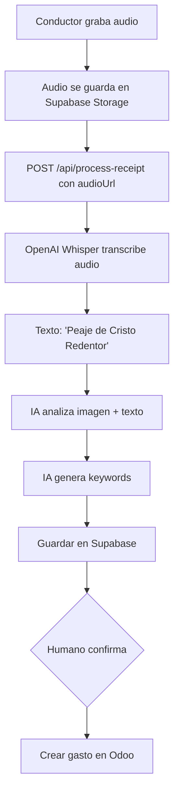

# Guía de Transcripción de Audio

## 🎤 Flujos Soportados

El endpoint `/api/process-receipt` ahora soporta **DOS formas** de describir el gasto:

### Flujo 1: Texto Directo ✍️

```json
{
  "trip_id": "uuid-del-viaje",
  "fotoUrl": "https://foto-boleta.jpg",
  "conductor_description": "Peaje de Cristo Redentor camino a Argentina"
}
```

**Proceso:**
1. Texto pasa directamente al agente IA
2. IA genera keywords basadas en imagen + texto
3. Se guarda en Supabase

### Flujo 2: Audio (Voz) 🎙️

```json
{
  "trip_id": "uuid-del-viaje",
  "fotoUrl": "https://foto-boleta.jpg",
  "audioUrl": "https://audio-grabado.webm"
}
```

**Proceso:**
1. Audio se transcribe con OpenAI Whisper
2. Transcripción → `conductor_description`
3. Texto pasa al agente IA
4. IA genera keywords basadas en imagen + texto transcrito
5. Se guarda en Supabase con info de transcripción

## 🔄 Flujo Completo con Audio



## 📝 Ejemplos de Uso

### Ejemplo 1: Con Texto

```bash
curl -X POST http://localhost:3000/api/process-receipt \
  -H "Content-Type: application/json" \
  -d '{
    "trip_id": "9667a068-5d5b-4cb7-a8b2-7068ed47782a",
    "fotoUrl": "https://supabase.co/storage/.../boleta.jpg",
    "conductor_description": "Peaje de Cristo Redentor"
  }'
```

### Ejemplo 2: Con Audio

```bash
curl -X POST http://localhost:3000/api/process-receipt \
  -H "Content-Type: application/json" \
  -d '{
    "trip_id": "9667a068-5d5b-4cb7-a8b2-7068ed47782a",
    "fotoUrl": "https://supabase.co/storage/.../boleta.jpg",
    "audioUrl": "https://supabase.co/storage/.../audio.webm"
  }'
```

### Respuesta (ambos casos):

```json
{
  "success": true,
  "message": "Receipt processed successfully",
  "data": {
    "boleta_id": "uuid",
    "estado": "espera",
    "extracted_data": {
      "descripcion": "Peaje autopista",
      "total": 15000,
      "keywords": ["peaje", "tag", "autopista", "internacional", "cristo redentor"]
    },
    "metadata": {
      "ai_keywords": ["peaje", "tag", "autopista", "internacional", "cristo redentor"],
      "conductor_description": "Peaje de Cristo Redentor",
      "audio_url": "https://...",  // Solo si vino audio
      "audio_transcribed": true,    // Solo si vino audio
      "transcription_language": "es" // Solo si vino audio
    }
  }
}
```

## ⚙️ Configuración de OpenAI

### Variable de Entorno

Ya está configurada en `.env`:

```bash
OPENAI_API_KEY="sk-proj-..."
```

### Modelo Usado

- **Whisper-1**: Modelo de transcripción de OpenAI
- Soporta múltiples formatos: webm, mp3, mp4, wav, etc.
- Detecta idioma automáticamente (configurado para español por defecto)

### Límites

- **Tamaño máximo**: 25 MB por archivo
- **Duración máxima**: ~2-3 minutos recomendado
- **Timeout del endpoint**: 120 segundos

## 🎯 Casos de Uso

### Caso 1: Conductor Habla Mientras Maneja

```
Conductor: "Peaje... eh... Cristo Redentor, ruta a Argentina"
↓
Whisper: "Peaje Cristo Redentor ruta a Argentina"
↓
IA Keywords: ["peaje", "cristo redentor", "internacional", "argentina", "autopista"]
↓
Categoría: PEAJES INTERNACIONALES ✅
```

### Caso 2: Audio con Ruido de Fondo

```
Conductor: "Cargué nafta en [ruido de motor] YPF"
↓
Whisper: "Cargué nafta en YPF" (filtra ruido)
↓
IA Keywords: ["combustible", "nafta", "ypf", "gasolina"]
↓
Categoría: COMBUSTIBLE ✅
```

### Caso 3: Audio Corto

```
Conductor: "Peaje"
↓
Whisper: "Peaje"
↓
IA Keywords: ["peaje", "tag", "autopista"]
↓
Categoría: PEAJES (genérico) ⚠️ (puede necesitar confirmación)
```

## 🔧 Implementación Técnica

### Servicio de Transcripción

**Ubicación**: `/lib/openai/transcribe.ts`

**Funciones:**
- `transcribeAudio(audioUrl)` - Transcribe audio a texto
- `isValidAudioUrl(url)` - Valida que la URL sea segura

**Proceso:**
1. Descarga el audio desde la URL
2. Convierte a blob/buffer
3. Envía a OpenAI Whisper API
4. Retorna transcripción + metadata

### Metadata Guardada

Cuando hay audio, se guarda:

```json
{
  "audio_url": "https://...",
  "audio_transcribed": true,
  "transcription": "Peaje de Cristo Redentor",
  "transcription_language": "es",
  "transcription_duration": 3.5
}
```

## 🚨 Manejo de Errores

### Error 1: Audio No Accesible

```json
{
  "error": "Audio transcription failed",
  "message": "Failed to fetch audio from URL: 404 Not Found",
  "boleta_id": "uuid",
  "status": "partial_success"
}
```

**Solución**: Verificar que la URL del audio sea pública y accesible

### Error 2: Formato No Soportado

```json
{
  "error": "Audio transcription failed",
  "message": "OpenAI Whisper API error: 400 - Unsupported file format"
}
```

**Solución**: Usar formatos soportados: webm, mp3, mp4, wav, etc.

### Error 3: Ambos Campos (Texto + Audio)

```json
{
  "error": "Invalid payload",
  "message": "No puedes enviar conductor_description y audioUrl al mismo tiempo. Elige uno."
}
```

**Solución**: Enviar solo uno de los dos campos

## 📱 Integración con Frontend

### UI Sugerida

```jsx
function BoletaUpload({ tripId }) {
  const [fotoUrl, setFotoUrl] = useState("");
  const [inputMode, setInputMode] = useState("text"); // "text" o "audio"
  const [texto, setTexto] = useState("");
  const [audioUrl, setAudioUrl] = useState("");
  const [isRecording, setIsRecording] = useState(false);

  const handleSubmit = async () => {
    const payload = {
      trip_id: tripId,
      fotoUrl: fotoUrl,
    };

    if (inputMode === "text") {
      payload.conductor_description = texto;
    } else {
      payload.audioUrl = audioUrl;
    }

    const response = await fetch("/api/process-receipt", {
      method: "POST",
      headers: { "Content-Type": "application/json" },
      body: JSON.stringify(payload),
    });

    // ...
  };

  return (
    <div>
      <ImageUpload onChange={setFotoUrl} />

      <div>
        <button onClick={() => setInputMode("text")}>
          ✍️ Escribir
        </button>
        <button onClick={() => setInputMode("audio")}>
          🎤 Grabar
        </button>
      </div>

      {inputMode === "text" ? (
        <textarea
          placeholder="Describe el gasto..."
          value={texto}
          onChange={(e) => setTexto(e.target.value)}
        />
      ) : (
        <AudioRecorder
          onRecordingComplete={(url) => setAudioUrl(url)}
          isRecording={isRecording}
          setIsRecording={setIsRecording}
        />
      )}

      <button onClick={handleSubmit}>Enviar</button>
    </div>
  );
}
```

## 🧪 Testing

### Test 1: Texto Directo

```bash
curl -X POST http://localhost:3000/api/process-receipt \
  -H "Content-Type: application/json" \
  -d '{
    "trip_id": "uuid",
    "fotoUrl": "https://...",
    "conductor_description": "Peaje"
  }'
```

### Test 2: Audio

```bash
# Primero, subir audio a Supabase Storage y obtener URL pública

curl -X POST http://localhost:3000/api/process-receipt \
  -H "Content-Type: application/json" \
  -d '{
    "trip_id": "uuid",
    "fotoUrl": "https://...",
    "audioUrl": "https://supabase.co/storage/.../audio.webm"
  }'
```

### Test 3: Validación de Error (Ambos Campos)

```bash
curl -X POST http://localhost:3000/api/process-receipt \
  -H "Content-Type: application/json" \
  -d '{
    "trip_id": "uuid",
    "fotoUrl": "https://...",
    "conductor_description": "Peaje",
    "audioUrl": "https://audio.webm"
  }'

# Debe retornar error 400
```

## 💰 Costos de OpenAI Whisper

- **Precio**: $0.006 USD por minuto de audio
- **Ejemplo**: Audio de 30 segundos = $0.003 USD
- **Estimación mensual**: 1000 boletas con audio de 30s = $3 USD

## ✅ Checklist de Implementación

Backend:
- [x] Servicio de transcripción (`/lib/openai/transcribe.ts`)
- [x] Endpoint actualizado (`/api/process-receipt`)
- [x] Validaciones de payload
- [x] Manejo de errores
- [x] Metadata en Supabase

Frontend (pendiente):
- [ ] Componente de grabación de audio
- [ ] Upload de audio a Supabase Storage
- [ ] UI para elegir texto vs audio
- [ ] Visualización de transcripción
- [ ] Manejo de estados de carga

## 📚 Referencias

- [OpenAI Whisper API Docs](https://platform.openai.com/docs/guides/speech-to-text)
- Formatos soportados: webm, mp3, mp4, mpeg, mpga, m4a, wav, ogg
- Límite de tamaño: 25 MB

---

**Última actualización**: 18 de Noviembre 2025
