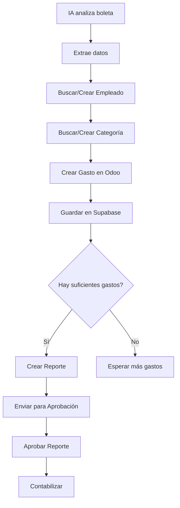

# Odoo 17 API - Documentación Completa para Automatización de Gastos

## Tabla de Contenidos
1. [Información de Conexión](#información-de-conexión)
2. [Autenticación](#autenticación)
3. [Modelos y Estructura](#modelos-y-estructura)
4. [Catálogos de Referencia](#catálogos-de-referencia)
5. [Operaciones CRUD en Gastos](#operaciones-crud-en-gastos)
6. [Gestión de Reportes de Gastos](#gestión-de-reportes-de-gastos)
7. [Workflow de Aprobación](#workflow-de-aprobación)
8. [Búsquedas Avanzadas](#búsquedas-avanzadas)
9. [Flujo Completo de Automatización](#flujo-completo-de-automatización)
10. [Recomendaciones para Supabase](#recomendaciones-para-supabase)

---

## Información de Conexión

```
URL Base: https://odoo17.odoosistema.com/
Endpoint JSON-RPC: https://odoo17.odoosistema.com/jsonrpc
Base de Datos: Tahan_Nov_2025
Usuario: juancruztahan@empresastahan.com
Password: 123456789
Versión: Odoo 17
```

---

## Autenticación

### Obtener UID (User ID)

```bash
curl -X POST https://odoo17.odoosistema.com/jsonrpc \
  -H "Content-Type: application/json" \
  -d '{
    "jsonrpc": "2.0",
    "method": "call",
    "params": {
      "service": "common",
      "method": "authenticate",
      "args": [
        "Tahan_Nov_2025",
        "juancruztahan@empresastahan.com",
        "123456789",
        {}
      ]
    },
    "id": 1
  }'
```

**Respuesta:**
```json
{
  "jsonrpc": "2.0",
  "id": 1,
  "result": 91
}
```

**UID obtenido: 91**

> **Nota:** El UID es necesario para todas las operaciones posteriores con `execute_kw`.

---

## Modelos y Estructura

### Modelo: `hr.expense` (Gastos Individuales)

#### Campos Principales

| Campo | Tipo | Requerido | Descripción | Valores Posibles |
|-------|------|-----------|-------------|------------------|
| `name` | char | Sí | Descripción del gasto | Texto libre |
| `employee_id` | many2one | Sí | Empleado | ID del empleado |
| `product_id` | many2one | No | Categoría del gasto | ID del producto |
| `date` | date | No | Fecha del gasto | YYYY-MM-DD |
| `quantity` | float | Sí | Cantidad | Número decimal |
| `total_amount` | monetary | No | Total en moneda de la empresa | Número decimal |
| `total_amount_currency` | monetary | No | Total en moneda original | Número decimal |
| `payment_mode` | selection | No | Pagado por | `own_account`, `company_account` |
| `currency_id` | many2one | Sí | Moneda | ID de moneda |
| `company_id` | many2one | Sí | Empresa | ID de empresa |
| `state` | selection | No | Estado | Ver tabla abajo |
| `sheet_id` | many2one | No | Reporte de gasto | ID del reporte |
| `description` | text | No | Notas internas | Texto libre |

#### Estados del Gasto (`state`)

| Valor | Etiqueta | Descripción |
|-------|----------|-------------|
| `draft` | To Report | Borrador, aún no reportado |
| `reported` | To Submit | Reportado, pendiente de enviar |
| `submitted` | Submitted | Enviado para aprobación |
| `approved` | Approved | Aprobado |
| `done` | Done | Completado |
| `refused` | Refused | Rechazado |

#### Modos de Pago (`payment_mode`)

| Valor | Etiqueta | Descripción |
|-------|----------|-------------|
| `own_account` | Employee (to reimburse) | El empleado pagó y debe ser reembolsado |
| `company_account` | Company | La empresa pagó directamente |

### Modelo: `hr.expense.sheet` (Reportes de Gastos)

#### Campos Principales

| Campo | Tipo | Requerido | Descripción |
|-------|------|-----------|-------------|
| `name` | char | Sí | Nombre del reporte |
| `employee_id` | many2one | Sí | Empleado |
| `expense_line_ids` | one2many | No | Lista de gastos incluidos |
| `state` | selection | Sí | Estado del reporte |
| `total_amount` | monetary | No | Total (calculado automáticamente) |
| `company_id` | many2one | Sí | Empresa |
| `payment_mode` | selection | No | Modo de pago |
| `currency_id` | many2one | No | Moneda |
| `approval_date` | datetime | No | Fecha de aprobación |
| `user_id` | many2one | No | Manager aprobador |

#### Estados del Reporte (`state`)

| Valor | Etiqueta | Descripción |
|-------|----------|-------------|
| `draft` | To Submit | Borrador |
| `submit` | Submitted | Enviado |
| `approve` | Approved | Aprobado |
| `post` | Posted | Contabilizado |
| `done` | Done | Completado |
| `cancel` | Refused | Rechazado |

---

## Catálogos de Referencia

### Empleados (`hr.employee`)

**Búsqueda de Empleados:**

```bash
curl -s -X POST https://odoo17.odoosistema.com/jsonrpc \
  -H "Content-Type: application/json" \
  -d '{
    "jsonrpc": "2.0",
    "method": "call",
    "params": {
      "service": "object",
      "method": "execute_kw",
      "args": [
        "Tahan_Nov_2025",
        91,
        "123456789",
        "hr.employee",
        "search_read",
        [],
        {
          "fields": ["id", "name", "work_email", "company_id"],
          "limit": 100
        }
      ]
    },
    "id": 1
  }'
```

**Ejemplos de Empleados en la BD:**

| ID | Nombre | Email | Empresa |
|----|--------|-------|---------|
| 970 | Alberto Angel Lujan | conductor@empresastahan.com | TURKEN (3) |
| 572 | Alberto Felipe Santini | conductor3@empresastahan.com | TURKEN (3) |

### Productos/Categorías de Gastos (`product.product`)

**Búsqueda de Productos que pueden ser gastos:**

```bash
curl -s -X POST https://odoo17.odoosistema.com/jsonrpc \
  -H "Content-Type: application/json" \
  -d '{
    "jsonrpc": "2.0",
    "method": "call",
    "params": {
      "service": "object",
      "method": "execute_kw",
      "args": [
        "Tahan_Nov_2025",
        91,
        "123456789",
        "product.product",
        "search_read",
        [[["can_be_expensed", "=", true]]],
        {
          "fields": ["id", "name", "default_code", "list_price"],
          "limit": 100
        }
      ]
    },
    "id": 1
  }'
```

**Ejemplos de Productos:**

| ID | Nombre | Código | Precio |
|----|--------|--------|--------|
| 46707 | PEAJES | - | 0.0 |
| 46161 | HERRAMIENTAS TALLER | 10030027 | 1.0 |

### Monedas (`res.currency`)

**Búsqueda de Monedas Activas:**

```bash
curl -s -X POST https://odoo17.odoosistema.com/jsonrpc \
  -H "Content-Type: application/json" \
  -d '{
    "jsonrpc": "2.0",
    "method": "call",
    "params": {
      "service": "object",
      "method": "execute_kw",
      "args": [
        "Tahan_Nov_2025",
        91,
        "123456789",
        "res.currency",
        "search_read",
        [[["active", "=", true]]],
        {
          "fields": ["id", "name", "symbol", "position"]
        }
      ]
    },
    "id": 1
  }'
```

**Monedas Disponibles:**

| ID | Código | Símbolo | Posición |
|----|--------|---------|----------|
| 19 | ARS | $ | before |
| 6 | BRL | R$ | before |
| 45 | CLP | $ | before |
| 154 | PEN | S/ | before |
| 155 | PYG | ₲ | after |
| 2 | USD | USD | before |

### Empresas (`res.company`)

**Búsqueda de Empresas:**

```bash
curl -s -X POST https://odoo17.odoosistema.com/jsonrpc \
  -H "Content-Type: application/json" \
  -d '{
    "jsonrpc": "2.0",
    "method": "call",
    "params": {
      "service": "object",
      "method": "execute_kw",
      "args": [
        "Tahan_Nov_2025",
        91,
        "123456789",
        "res.company",
        "search_read",
        [],
        {
          "fields": ["id", "name", "currency_id"]
        }
      ]
    },
    "id": 1
  }'
```

**Empresas en la BD:**

| ID | Nombre | Moneda |
|----|--------|--------|
| 1 | EXITRANS S.A. | ARS (19) |
| 3 | EXPORTADORA E IMPORTADORA TURKEN S A | CLP (45) |
| 4 | THP LOGISTICA S.A | PYG (155) |
| 2 | THB INTERNACIONAL LTDA | BRL (6) |

---

## Operaciones CRUD en Gastos

### 1. CREATE - Crear un Gasto

```bash
curl -s -X POST https://odoo17.odoosistema.com/jsonrpc \
  -H "Content-Type: application/json" \
  -d '{
    "jsonrpc": "2.0",
    "method": "call",
    "params": {
      "service": "object",
      "method": "execute_kw",
      "args": [
        "Tahan_Nov_2025",
        91,
        "123456789",
        "hr.expense",
        "create",
        [
          {
            "name": "Peaje Ruta 5",
            "date": "2025-11-17",
            "employee_id": 970,
            "product_id": 46707,
            "quantity": 1,
            "total_amount": 15000.0,
            "total_amount_currency": 15000.0,
            "payment_mode": "own_account",
            "currency_id": 45,
            "company_id": 3
          }
        ],
        {
          "context": {
            "allowed_company_ids": [3],
            "force_company": 3
          }
        }
      ]
    },
    "id": 1
  }'
```

**Respuesta:**
```json
{
  "jsonrpc": "2.0",
  "id": 1,
  "result": 4263
}
```

> El ID devuelto (4263) es el identificador del gasto creado.

### 2. READ - Leer un Gasto

```bash
curl -s -X POST https://odoo17.odoosistema.com/jsonrpc \
  -H "Content-Type: application/json" \
  -d '{
    "jsonrpc": "2.0",
    "method": "call",
    "params": {
      "service": "object",
      "method": "execute_kw",
      "args": [
        "Tahan_Nov_2025",
        91,
        "123456789",
        "hr.expense",
        "read",
        [[4263]],
        {
          "fields": ["id", "name", "date", "employee_id", "product_id", "total_amount", "state"]
        }
      ]
    },
    "id": 1
  }'
```

**Respuesta:**
```json
{
  "jsonrpc": "2.0",
  "id": 1,
  "result": [
    {
      "id": 4263,
      "name": "Peaje Ruta 5",
      "date": "2025-11-17",
      "employee_id": [970, "Alberto Angel Lujan"],
      "product_id": [46707, "PEAJES\n"],
      "total_amount": 15000.0,
      "state": "draft"
    }
  ]
}
```

### 3. UPDATE - Actualizar un Gasto

```bash
curl -s -X POST https://odoo17.odoosistema.com/jsonrpc \
  -H "Content-Type: application/json" \
  -d '{
    "jsonrpc": "2.0",
    "method": "call",
    "params": {
      "service": "object",
      "method": "execute_kw",
      "args": [
        "Tahan_Nov_2025",
        91,
        "123456789",
        "hr.expense",
        "write",
        [[4263], {
          "description": "Peaje en ruta - Actualizado",
          "total_amount": 18000.0,
          "total_amount_currency": 18000.0
        }]
      ]
    },
    "id": 1
  }'
```

**Respuesta:**
```json
{
  "jsonrpc": "2.0",
  "id": 1,
  "result": true
}
```

### 4. DELETE - Eliminar un Gasto

```bash
curl -s -X POST https://odoo17.odoosistema.com/jsonrpc \
  -H "Content-Type: application/json" \
  -d '{
    "jsonrpc": "2.0",
    "method": "call",
    "params": {
      "service": "object",
      "method": "execute_kw",
      "args": [
        "Tahan_Nov_2025",
        91,
        "123456789",
        "hr.expense",
        "unlink",
        [[4263]]
      ]
    },
    "id": 1
  }'
```

### 5. CREATE MULTIPLE - Crear Múltiples Gastos

```bash
curl -s -X POST https://odoo17.odoosistema.com/jsonrpc \
  -H "Content-Type: application/json" \
  -d '{
    "jsonrpc": "2.0",
    "method": "call",
    "params": {
      "service": "object",
      "method": "execute_kw",
      "args": [
        "Tahan_Nov_2025",
        91,
        "123456789",
        "hr.expense",
        "create",
        [
          [
            {
              "name": "Peaje Ruta 5",
              "date": "2025-11-17",
              "employee_id": 970,
              "product_id": 46707,
              "quantity": 1,
              "total_amount": 15000.0,
              "total_amount_currency": 15000.0,
              "payment_mode": "own_account",
              "currency_id": 45,
              "company_id": 3
            },
            {
              "name": "Combustible Diesel",
              "date": "2025-11-17",
              "employee_id": 970,
              "product_id": 46707,
              "quantity": 1,
              "total_amount": 85000.0,
              "total_amount_currency": 85000.0,
              "payment_mode": "own_account",
              "currency_id": 45,
              "company_id": 3
            }
          ]
        ],
        {
          "context": {
            "allowed_company_ids": [3],
            "force_company": 3
          }
        }
      ]
    },
    "id": 1
  }'
```

**Respuesta:**
```json
{
  "jsonrpc": "2.0",
  "id": 1,
  "result": [4263, 4264]
}
```

---

## Gestión de Reportes de Gastos

### 1. Crear un Reporte con Múltiples Gastos

```bash
curl -s -X POST https://odoo17.odoosistema.com/jsonrpc \
  -H "Content-Type: application/json" \
  -d '{
    "jsonrpc": "2.0",
    "method": "call",
    "params": {
      "service": "object",
      "method": "execute_kw",
      "args": [
        "Tahan_Nov_2025",
        91,
        "123456789",
        "hr.expense.sheet",
        "create",
        [
          {
            "name": "Reporte de Gastos - Noviembre 2025 - Alberto Lujan",
            "employee_id": 970,
            "expense_line_ids": [[6, 0, [4263, 4264, 4265]]],
            "company_id": 3
          }
        ],
        {
          "context": {
            "allowed_company_ids": [3],
            "force_company": 3
          }
        }
      ]
    },
    "id": 1
  }'
```

**Respuesta:**
```json
{
  "jsonrpc": "2.0",
  "id": 1,
  "result": 1624
}
```

> **Nota sobre `expense_line_ids`:**
> - La sintaxis `[[6, 0, [IDs]]]` es la forma de Odoo para operaciones many2many/one2many
> - `6` = "Reemplazar todos los registros con estos IDs"
> - `0` = No usado en este comando
> - `[4263, 4264, 4265]` = Lista de IDs de gastos a incluir

**Otras operaciones disponibles:**
- `[[4, ID]]` = Agregar un registro existente
- `[[3, ID]]` = Remover un registro (sin eliminarlo)
- `[[5]]` = Remover todos los registros

### 2. Leer un Reporte

```bash
curl -s -X POST https://odoo17.odoosistema.com/jsonrpc \
  -H "Content-Type: application/json" \
  -d '{
    "jsonrpc": "2.0",
    "method": "call",
    "params": {
      "service": "object",
      "method": "execute_kw",
      "args": [
        "Tahan_Nov_2025",
        91,
        "123456789",
        "hr.expense.sheet",
        "read",
        [[1624]],
        {
          "fields": ["id", "name", "employee_id", "expense_line_ids", "state", "total_amount"]
        }
      ]
    },
    "id": 1
  }'
```

**Respuesta:**
```json
{
  "jsonrpc": "2.0",
  "id": 1,
  "result": [
    {
      "id": 1624,
      "name": "Reporte de Gastos - Noviembre 2025 - Alberto Lujan",
      "employee_id": [970, "Alberto Angel Lujan"],
      "expense_line_ids": [4265, 4264, 4263],
      "state": "draft",
      "total_amount": 108000.0
    }
  ]
}
```

> **Nota:** El `total_amount` se calcula automáticamente sumando todos los gastos incluidos.

---

## Workflow de Aprobación

### Flujo Completo de Estados

```
draft → submit → approve → post → done
          ↓
       cancel (rechazado en cualquier momento)
```

### 1. Enviar Reporte (Submit)

```bash
curl -s -X POST https://odoo17.odoosistema.com/jsonrpc \
  -H "Content-Type: application/json" \
  -d '{
    "jsonrpc": "2.0",
    "method": "call",
    "params": {
      "service": "object",
      "method": "execute_kw",
      "args": [
        "Tahan_Nov_2025",
        91,
        "123456789",
        "hr.expense.sheet",
        "action_submit_sheet",
        [[1624]]
      ]
    },
    "id": 1
  }'
```

**Estado después:** `submit`

### 2. Aprobar Reporte (Approve)

```bash
curl -s -X POST https://odoo17.odoosistema.com/jsonrpc \
  -H "Content-Type: application/json" \
  -d '{
    "jsonrpc": "2.0",
    "method": "call",
    "params": {
      "service": "object",
      "method": "execute_kw",
      "args": [
        "Tahan_Nov_2025",
        91,
        "123456789",
        "hr.expense.sheet",
        "action_approve_expense_sheets",
        [[1624]]
      ]
    },
    "id": 1
  }'
```

**Estado después:** `approve`

### 3. Contabilizar Reporte (Post)

```bash
curl -s -X POST https://odoo17.odoosistema.com/jsonrpc \
  -H "Content-Type: application/json" \
  -d '{
    "jsonrpc": "2.0",
    "method": "call",
    "params": {
      "service": "object",
      "method": "execute_kw",
      "args": [
        "Tahan_Nov_2025",
        91,
        "123456789",
        "hr.expense.sheet",
        "action_sheet_move_create",
        [[1624]]
      ]
    },
    "id": 1
  }'
```

**Estado después:** `post`

### 4. Rechazar Reporte (Refuse)

```bash
curl -s -X POST https://odoo17.odoosistema.com/jsonrpc \
  -H "Content-Type: application/json" \
  -d '{
    "jsonrpc": "2.0",
    "method": "call",
    "params": {
      "service": "object",
      "method": "execute_kw",
      "args": [
        "Tahan_Nov_2025",
        91,
        "123456789",
        "hr.expense.sheet",
        "action_refuse_sheet",
        [[1624]]
      ]
    },
    "id": 1
  }'
```

**Estado después:** `cancel`

---

## Búsquedas Avanzadas

### Operadores de Búsqueda en Odoo

| Operador | Descripción | Ejemplo |
|----------|-------------|---------|
| `=` | Igual a | `["employee_id", "=", 970]` |
| `!=` | Diferente de | `["state", "!=", "draft"]` |
| `>` | Mayor que | `["total_amount", ">", 50000]` |
| `>=` | Mayor o igual | `["date", ">=", "2025-11-01"]` |
| `<` | Menor que | `["total_amount", "<", 100000]` |
| `<=` | Menor o igual | `["date", "<=", "2025-11-30"]` |
| `in` | Está en lista | `["state", "in", ["draft", "submit"]]` |
| `not in` | No está en lista | `["state", "not in", ["cancel", "refuse"]]` |
| `like` | Contiene (case-sensitive) | `["name", "like", "Peaje"]` |
| `ilike` | Contiene (case-insensitive) | `["name", "ilike", "peaje"]` |

### 1. Buscar Gastos sin Asignar a Reporte

```bash
curl -s -X POST https://odoo17.odoosistema.com/jsonrpc \
  -H "Content-Type: application/json" \
  -d '{
    "jsonrpc": "2.0",
    "method": "call",
    "params": {
      "service": "object",
      "method": "execute_kw",
      "args": [
        "Tahan_Nov_2025",
        91,
        "123456789",
        "hr.expense",
        "search_read",
        [[
          ["sheet_id", "=", false],
          ["state", "=", "draft"],
          ["employee_id", "=", 970]
        ]],
        {
          "fields": ["id", "name", "date", "total_amount"],
          "order": "date desc"
        }
      ]
    },
    "id": 1
  }'
```

### 2. Buscar Gastos por Rango de Fechas

```bash
curl -s -X POST https://odoo17.odoosistema.com/jsonrpc \
  -H "Content-Type: application/json" \
  -d '{
    "jsonrpc": "2.0",
    "method": "call",
    "params": {
      "service": "object",
      "method": "execute_kw",
      "args": [
        "Tahan_Nov_2025",
        91,
        "123456789",
        "hr.expense",
        "search_read",
        [[
          ["date", ">=", "2025-11-01"],
          ["date", "<=", "2025-11-30"],
          ["employee_id", "=", 970]
        ]],
        {
          "fields": ["id", "name", "date", "total_amount"],
          "order": "date asc"
        }
      ]
    },
    "id": 1
  }'
```

### 3. Buscar Gastos Pendientes de Aprobación

```bash
curl -s -X POST https://odoo17.odoosistema.com/jsonrpc \
  -H "Content-Type: application/json" \
  -d '{
    "jsonrpc": "2.0",
    "method": "call",
    "params": {
      "service": "object",
      "method": "execute_kw",
      "args": [
        "Tahan_Nov_2025",
        91,
        "123456789",
        "hr.expense",
        "search_read",
        [[
          ["state", "in", ["reported", "submitted"]]
        ]],
        {
          "fields": ["id", "name", "employee_id", "total_amount", "state"],
          "limit": 50
        }
      ]
    },
    "id": 1
  }'
```

### 4. Buscar Gastos por Monto Mínimo

```bash
curl -s -X POST https://odoo17.odoosistema.com/jsonrpc \
  -H "Content-Type: application/json" \
  -d '{
    "jsonrpc": "2.0",
    "method": "call",
    "params": {
      "service": "object",
      "method": "execute_kw",
      "args": [
        "Tahan_Nov_2025",
        91,
        "123456789",
        "hr.expense",
        "search_read",
        [[
          ["total_amount", ">=", 50000],
          ["employee_id", "=", 970]
        ]],
        {
          "fields": ["id", "name", "total_amount", "date"],
          "order": "total_amount desc"
        }
      ]
    },
    "id": 1
  }'
```

### 5. Contar Gastos (Count)

```bash
curl -s -X POST https://odoo17.odoosistema.com/jsonrpc \
  -H "Content-Type: application/json" \
  -d '{
    "jsonrpc": "2.0",
    "method": "call",
    "params": {
      "service": "object",
      "method": "execute_kw",
      "args": [
        "Tahan_Nov_2025",
        91,
        "123456789",
        "hr.expense",
        "search_count",
        [[
          ["employee_id", "=", 970],
          ["state", "=", "draft"]
        ]]
      ]
    },
    "id": 1
  }'
```

---

## Flujo Completo de Automatización

### Escenario: Procesamiento Automático de Boletas



### Paso 1: Crear Gasto desde IA

```javascript
// Datos extraídos de la boleta por IA
const bolelaData = {
  conductor: "Alberto Angel Lujan",
  fecha: "2025-11-17",
  concepto: "Peaje Ruta 5",
  monto: 15000,
  moneda: "CLP",
  empresa: "TURKEN"
};

// 1. Buscar empleado por nombre
const findEmployee = {
  "jsonrpc": "2.0",
  "method": "call",
  "params": {
    "service": "object",
    "method": "execute_kw",
    "args": [
      "Tahan_Nov_2025",
      91,
      "123456789",
      "hr.employee",
      "search_read",
      [[["name", "ilike", bolelaData.conductor]]],
      {
        "fields": ["id", "name", "company_id"],
        "limit": 1
      }
    ]
  },
  "id": 1
};

// 2. Crear el gasto
const createExpense = {
  "jsonrpc": "2.0",
  "method": "call",
  "params": {
    "service": "object",
    "method": "execute_kw",
    "args": [
      "Tahan_Nov_2025",
      91,
      "123456789",
      "hr.expense",
      "create",
      [
        {
          "name": bolelaData.concepto,
          "date": bolelaData.fecha,
          "employee_id": 970, // ID obtenido del paso 1
          "product_id": 46707, // Categoría "PEAJES"
          "quantity": 1,
          "total_amount": bolelaData.monto,
          "total_amount_currency": bolelaData.monto,
          "payment_mode": "own_account",
          "currency_id": 45, // CLP
          "company_id": 3 // TURKEN
        }
      ],
      {
        "context": {
          "allowed_company_ids": [3],
          "force_company": 3
        }
      }
    ]
  },
  "id": 2
};
```

### Paso 2: Agrupar Gastos Automáticamente

```javascript
// 1. Buscar gastos sin reporte del empleado
const searchUnassignedExpenses = {
  "jsonrpc": "2.0",
  "method": "call",
  "params": {
    "service": "object",
    "method": "execute_kw",
    "args": [
      "Tahan_Nov_2025",
      91,
      "123456789",
      "hr.expense",
      "search_read",
      [[
        ["sheet_id", "=", false],
        ["state", "=", "draft"],
        ["employee_id", "=", 970],
        ["date", ">=", "2025-11-01"],
        ["date", "<=", "2025-11-30"]
      ]],
      {
        "fields": ["id", "name", "total_amount"]
      }
    ]
  },
  "id": 3
};

// 2. Si hay suficientes gastos (ej: 5 o más), crear reporte
const expenseIds = [4263, 4264, 4265, 4266, 4267];

const createReport = {
  "jsonrpc": "2.0",
  "method": "call",
  "params": {
    "service": "object",
    "method": "execute_kw",
    "args": [
      "Tahan_Nov_2025",
      91,
      "123456789",
      "hr.expense.sheet",
      "create",
      [
        {
          "name": `Reporte Alberto Lujan - Noviembre 2025`,
          "employee_id": 970,
          "expense_line_ids": [[6, 0, expenseIds]],
          "company_id": 3
        }
      ],
      {
        "context": {
          "allowed_company_ids": [3],
          "force_company": 3
        }
      }
    ]
  },
  "id": 4
};
```

### Paso 3: Workflow Automático (Opcional)

```javascript
// 1. Enviar reporte automáticamente
const submitReport = {
  "jsonrpc": "2.0",
  "method": "call",
  "params": {
    "service": "object",
    "method": "execute_kw",
    "args": [
      "Tahan_Nov_2025",
      91,
      "123456789",
      "hr.expense.sheet",
      "action_submit_sheet",
      [[1624]] // ID del reporte
    ]
  },
  "id": 5
};

// 2. Si auto-aprobación está permitida (solo para ciertos casos)
const approveReport = {
  "jsonrpc": "2.0",
  "method": "call",
  "params": {
    "service": "object",
    "method": "execute_kw",
    "args": [
      "Tahan_Nov_2025",
      91,
      "123456789",
      "hr.expense.sheet",
      "action_approve_expense_sheets",
      [[1624]]
    ]
  },
  "id": 6
};
```

---

## Recomendaciones para Supabase

### Tablas Sugeridas para Cache

#### 1. Tabla: `odoo_employees`

```sql
CREATE TABLE odoo_employees (
  id SERIAL PRIMARY KEY,
  odoo_id INTEGER UNIQUE NOT NULL,
  name TEXT NOT NULL,
  email TEXT,
  company_id INTEGER,
  company_name TEXT,
  created_at TIMESTAMPTZ DEFAULT NOW(),
  updated_at TIMESTAMPTZ DEFAULT NOW()
);

CREATE INDEX idx_odoo_employees_name ON odoo_employees(name);
CREATE INDEX idx_odoo_employees_email ON odoo_employees(email);
```

**Uso:**
- Cachear empleados para búsquedas rápidas por nombre/email
- Evitar llamadas repetidas a Odoo
- Actualizar diariamente o cuando hay cambios

#### 2. Tabla: `odoo_expense_categories`

```sql
CREATE TABLE odoo_expense_categories (
  id SERIAL PRIMARY KEY,
  odoo_id INTEGER UNIQUE NOT NULL,
  name TEXT NOT NULL,
  code TEXT,
  keywords TEXT[], -- Para matching con IA
  created_at TIMESTAMPTZ DEFAULT NOW(),
  updated_at TIMESTAMPTZ DEFAULT NOW()
);

CREATE INDEX idx_categories_name ON odoo_expense_categories(name);
CREATE INDEX idx_categories_keywords ON odoo_expense_categories USING GIN(keywords);
```

**Uso:**
- Mapear descripciones de boletas a categorías de Odoo
- IA puede usar keywords para clasificar automáticamente
- Ejemplo: keywords = ["peaje", "tag", "autopista"] → Categoría "PEAJES"

#### 3. Tabla: `odoo_currencies`

```sql
CREATE TABLE odoo_currencies (
  id SERIAL PRIMARY KEY,
  odoo_id INTEGER UNIQUE NOT NULL,
  code TEXT NOT NULL,
  symbol TEXT,
  position TEXT,
  created_at TIMESTAMPTZ DEFAULT NOW()
);
```

#### 4. Tabla: `odoo_companies`

```sql
CREATE TABLE odoo_companies (
  id SERIAL PRIMARY KEY,
  odoo_id INTEGER UNIQUE NOT NULL,
  name TEXT NOT NULL,
  currency_id INTEGER,
  currency_code TEXT,
  created_at TIMESTAMPTZ DEFAULT NOW(),
  updated_at TIMESTAMPTZ DEFAULT NOW()
);
```

#### 5. Tabla: `expense_processing_log`

```sql
CREATE TABLE expense_processing_log (
  id SERIAL PRIMARY KEY,
  boleta_id UUID REFERENCES boletas(id),
  odoo_expense_id INTEGER,
  odoo_sheet_id INTEGER,
  status TEXT CHECK (status IN ('pending', 'created', 'in_report', 'approved', 'error')),
  error_message TEXT,
  created_at TIMESTAMPTZ DEFAULT NOW(),
  processed_at TIMESTAMPTZ
);

CREATE INDEX idx_expense_log_status ON expense_processing_log(status);
CREATE INDEX idx_expense_log_boleta ON expense_processing_log(boleta_id);
```

**Uso:**
- Trackear el estado de cada boleta procesada
- Relacionar boletas de Supabase con gastos de Odoo
- Debugging y auditoría

#### 6. Tabla: `odoo_sync_status`

```sql
CREATE TABLE odoo_sync_status (
  id SERIAL PRIMARY KEY,
  table_name TEXT NOT NULL,
  last_sync_at TIMESTAMPTZ,
  record_count INTEGER,
  status TEXT CHECK (status IN ('success', 'error', 'in_progress')),
  error_message TEXT
);
```

**Uso:**
- Controlar cuándo se sincronizó cada catálogo
- Evitar sincronizaciones innecesarias

### Script de Sincronización Automática

```javascript
// Función para sincronizar empleados desde Odoo a Supabase
async function syncEmployees() {
  // 1. Obtener empleados de Odoo
  const odooEmployees = await fetchFromOdoo({
    model: "hr.employee",
    method: "search_read",
    domain: [],
    fields: ["id", "name", "work_email", "company_id"]
  });

  // 2. Actualizar en Supabase
  for (const emp of odooEmployees) {
    await supabase
      .from('odoo_employees')
      .upsert({
        odoo_id: emp.id,
        name: emp.name,
        email: emp.work_email,
        company_id: emp.company_id[0],
        company_name: emp.company_id[1],
        updated_at: new Date()
      }, {
        onConflict: 'odoo_id'
      });
  }

  // 3. Actualizar log de sincronización
  await supabase
    .from('odoo_sync_status')
    .upsert({
      table_name: 'odoo_employees',
      last_sync_at: new Date(),
      record_count: odooEmployees.length,
      status: 'success'
    }, {
      onConflict: 'table_name'
    });
}

// Ejecutar sincronización diaria
// Puedes usar un cron job o Supabase Edge Functions
```

### Estrategia de Matching con IA

```javascript
// Ejemplo de cómo la IA puede usar los catálogos cacheados
async function matchExpenseData(aiExtractedData) {
  const { conductor, categoria, empresa, monto, moneda } = aiExtractedData;

  // 1. Buscar empleado en cache de Supabase
  const { data: employee } = await supabase
    .from('odoo_employees')
    .select('*')
    .ilike('name', `%${conductor}%`)
    .limit(1)
    .single();

  // 2. Buscar categoría por keywords
  const { data: category } = await supabase
    .from('odoo_expense_categories')
    .select('*')
    .contains('keywords', [categoria.toLowerCase()])
    .limit(1)
    .single();

  // 3. Buscar moneda
  const { data: currency } = await supabase
    .from('odoo_currencies')
    .select('*')
    .eq('code', moneda)
    .single();

  // 4. Buscar empresa
  const { data: company } = await supabase
    .from('odoo_companies')
    .select('*')
    .ilike('name', `%${empresa}%`)
    .limit(1)
    .single();

  return {
    employee_id: employee?.odoo_id,
    product_id: category?.odoo_id,
    currency_id: currency?.odoo_id,
    company_id: company?.odoo_id
  };
}
```

---

## Mejores Prácticas

### 1. Manejo de Errores

Siempre verifica si hay errores en la respuesta:

```javascript
const response = await fetch('https://odoo17.odoosistema.com/jsonrpc', {
  method: 'POST',
  headers: { 'Content-Type': 'application/json' },
  body: JSON.stringify(request)
});

const data = await response.json();

if (data.error) {
  console.error('Error de Odoo:', data.error.message);
  console.error('Debug:', data.error.data.debug);
  throw new Error(data.error.message);
}

return data.result;
```

### 2. Context para Multi-Company

Siempre especifica el contexto cuando trabajas con múltiples empresas:

```javascript
{
  "context": {
    "allowed_company_ids": [3],  // IDs de empresas permitidas
    "force_company": 3            // Forzar empresa específica
  }
}
```

### 3. Batch Operations

Para crear múltiples registros, usa arrays:

```javascript
// Crear múltiples gastos en una sola llamada
"create",
[
  [
    { gasto1 },
    { gasto2 },
    { gasto3 }
  ]
]
```

### 4. Paginación

Para datasets grandes, usa limit y offset:

```javascript
{
  "fields": ["id", "name"],
  "limit": 100,
  "offset": 0,
  "order": "date desc"
}
```

### 5. Cache de Catálogos

- Sincroniza empleados, productos, monedas y empresas en Supabase
- Actualiza diariamente o cuando detectes cambios
- Usa estos datos para validación y matching rápido

### 6. Validación Previa

Antes de crear gastos, valida:
- ✅ El empleado existe
- ✅ La categoría (producto) existe y `can_be_expensed = true`
- ✅ La moneda está activa
- ✅ La empresa es válida
- ✅ Los montos son positivos
- ✅ Las fechas son válidas

### 7. Logging y Auditoría

Mantén un registro de:
- Cada gasto creado (ID de Odoo + ID de boleta)
- Errores durante el proceso
- Reportes generados
- Estados de aprobación

---

## Troubleshooting

### Error: "The method does not exist"

**Problema:** Intentas llamar un método que no existe.

**Solución:** Verifica el nombre exacto del método. Algunos métodos comunes:
- `action_submit_sheet` (no `submit_sheet`)
- `action_approve_expense_sheets` (no `approve_expense_sheets`)

### Error: "Field does not exist"

**Problema:** El campo no existe en el modelo.

**Solución:** Usa `fields_get` para ver todos los campos disponibles:

```bash
curl -s -X POST https://odoo17.odoosistema.com/jsonrpc \
  -H "Content-Type: application/json" \
  -d '{
    "jsonrpc": "2.0",
    "method": "call",
    "params": {
      "service": "object",
      "method": "execute_kw",
      "args": [
        "Tahan_Nov_2025",
        91,
        "123456789",
        "hr.expense",
        "fields_get",
        [],
        {}
      ]
    },
    "id": 1
  }'
```

### Error: "Access Denied"

**Problema:** El usuario no tiene permisos.

**Solución:** Verifica que el usuario tenga los permisos necesarios en Odoo (Expense User, Manager, etc.)

### Error: "company_id is required"

**Problema:** Falta el company_id o no está en el contexto.

**Solución:** Siempre incluye `company_id` en el registro y en el contexto.

---

## Recursos Adicionales

- **Documentación Oficial Odoo 17:** https://www.odoo.com/documentation/17.0/
- **External API Reference:** https://www.odoo.com/documentation/17.0/developer/reference/external_api.html
- **HR Expense Module:** https://www.odoo.com/documentation/17.0/applications/finance/expenses.html

---

## Resumen Ejecutivo

### Para crear un gasto necesitas:

1. **UID** (autenticación) ✅
2. **employee_id** (conductor)
3. **product_id** (categoría del gasto)
4. **currency_id** (moneda)
5. **company_id** (empresa)
6. **name** (descripción)
7. **quantity** (cantidad)
8. **total_amount** (monto total)
9. **payment_mode** (`own_account` o `company_account`)
10. **date** (fecha del gasto)

### Para crear un reporte necesitas:

1. **UID** (autenticación) ✅
2. **employee_id** (conductor)
3. **expense_line_ids** (lista de IDs de gastos)
4. **company_id** (empresa)
5. **name** (nombre del reporte)

### Workflow recomendado:

```
1. Analizar boleta con IA
2. Buscar/validar empleado, categoría, moneda, empresa (desde cache Supabase)
3. Crear gasto en Odoo
4. Guardar relación boleta-gasto en Supabase
5. Cuando haya suficientes gastos sin reporte:
   a. Buscar gastos sin asignar del empleado
   b. Crear reporte con esos gastos
   c. Enviar para aprobación (opcional)
6. Manager aprueba en Odoo
7. Contabilizar y marcar como Done
```

---

**Fecha de Documentación:** 17 de Noviembre 2025
**Versión:** 1.0
**Autor:** Claude (Anthropic)
**Base de Datos de Prueba:** Tahan_Nov_2025
