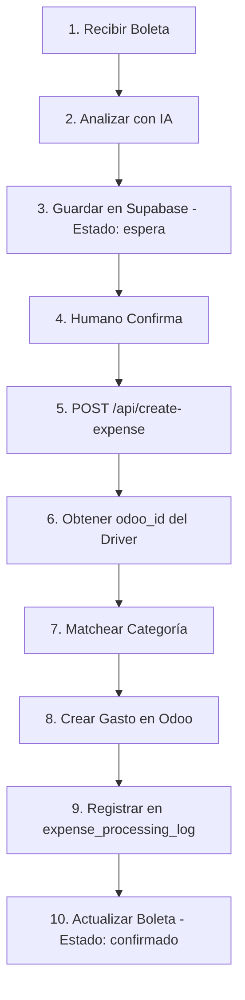

# API de Creación de Gastos en Odoo

Este documento describe la implementación del workflow para crear gastos automáticamente en Odoo 17 desde boletas procesadas.

## Flujo Completo del Workflow



## Arquitectura

### 1. Componentes Principales

- **`/lib/odoo/client.ts`**: Cliente para comunicarse con Odoo 17 JSON-RPC API
- **`/lib/odoo/types.ts`**: Tipos TypeScript y constantes para Odoo
- **`/lib/odoo/category-matcher.ts`**: Servicio para matchear descripciones con categorías
- **`/app/api/create-expense/route.ts`**: Endpoint principal del workflow

### 2. Tablas de Supabase Utilizadas

#### `drivers_info` (Vista)
- Contiene información de choferes con su `odoo_id`
- Campos: `user_id`, `nombre_completo`, `email`, `odoo_id`

#### `odoo_expense_categories`
- Cache de categorías de gastos desde Odoo
- Campos: `odoo_id`, `name`, `code`, `keywords[]`
- Los `keywords` permiten hacer matching automático

#### `expense_processing_log`
- Log de procesamiento de boletas a gastos
- Estados: `pending`, `created`, `in_report`, `approved`, `error`

#### `boletas`
- Boletas analizadas por IA
- Estados: `creado`, `procesando`, `espera`, `confirmado`, `cancelado`

## API Endpoints

### POST `/api/create-expense`

Crea un gasto en Odoo desde una boleta confirmada.

#### Request Body

```json
{
  "boleta_id": "uuid-de-la-boleta",
  "product_id": 46707  // Opcional: ID de categoría en Odoo
}
```

#### Respuesta Exitosa (201)

```json
{
  "success": true,
  "message": "Expense created successfully in Odoo",
  "data": {
    "boleta_id": "uuid-de-la-boleta",
    "odoo_expense_id": 4263,
    "employee_id": 970,
    "employee_name": "Alberto Angel Lujan",
    "category_id": 46707,
    "total": 15000,
    "currency": "CLP",
    "company": "EXPORTADORA E IMPORTADORA TURKEN S A"
  }
}
```

#### Errores Posibles

- **400**: Boleta no está en estado válido
- **404**: Boleta no encontrada / Driver sin odoo_id / Categoría no encontrada
- **500**: Error al crear gasto en Odoo

### GET `/api/create-expense?boleta_id=xxx`

Verifica el estado de un gasto creado.

#### Respuesta

```json
{
  "success": true,
  "data": {
    "log": {
      "id": 1,
      "boleta_id": "uuid",
      "odoo_expense_id": 4263,
      "status": "created",
      "processed_at": "2025-11-17T...",
      "metadata": { ... }
    },
    "odoo_expense": {
      "id": 4263,
      "name": "Peaje Ruta 5",
      "state": "draft",
      "total_amount": 15000,
      ...
    }
  }
}
```

## Configuración

### Variables de Entorno Requeridas

Agregar al archivo `.env`:

```bash
# Odoo API Configuration
ODOO_URL=https://odoo17.odoosistema.com
ODOO_DATABASE=Tahan_Nov_2025
ODOO_USERNAME=juancruztahan@empresastahan.com
ODOO_PASSWORD=123456789

# Supabase (ya existentes)
NEXT_PUBLIC_SUPABASE_URL=your-supabase-url
SUPABASE_SECRET_KEY=your-supabase-secret-key
```

## Datos Predeterminados

### Empresa

Siempre se usa **EXPORTADORA E IMPORTADORA TURKEN S.A.**:
- **ID en Odoo**: 3
- **Moneda**: CLP (ID: 45)

### Monedas Soportadas

```typescript
const CURRENCY_MAP = {
  ARS: 19,  // Peso Argentino
  BRL: 6,   // Real Brasileño
  CLP: 45,  // Peso Chileno
  PEN: 154, // Sol Peruano
  PYG: 155, // Guaraní Paraguayo
  USD: 2,   // Dólar
};
```

### Payment Mode

Por defecto: `own_account` (El empleado pagó y debe ser reembolsado)

## Matching de Categorías

### ¿Cómo funciona?

1. Si se proporciona `product_id` en el request, se usa directamente
2. Si no, se intenta matchear automáticamente usando `category-matcher.ts`:
   - Busca match exacto con keywords
   - Busca match parcial (keywords contenidos en la descripción)
   - Retorna la mejor coincidencia con un nivel de confianza

### Ejemplo de Keywords

Para configurar keywords en Supabase (`odoo_expense_categories`):

```sql
UPDATE odoo_expense_categories
SET keywords = ARRAY['peaje', 'tag', 'autopista', 'toll', 'ruta']
WHERE odoo_id = 46707; -- PEAJES

UPDATE odoo_expense_categories
SET keywords = ARRAY['combustible', 'diesel', 'gasolina', 'nafta', 'gas']
WHERE odoo_id = 12345; -- COMBUSTIBLE (ejemplo)
```

## Respuesta a la Pregunta sobre Auto-completado

### ¿Se auto-completan categoría, cuenta y distribución analítica?

**Sí**, automáticamente en Odoo cuando especificas el `product_id`:

1. **En la UI de Odoo**: Cuando escribes "peaje", busca productos y al seleccionarlo usa su `product_id`
2. **Por API**: Cuando envías `product_id`, Odoo automáticamente:
   - Aplica la cuenta contable configurada en ese producto
   - Aplica la distribución analítica asociada
   - Usa cualquier otra configuración del producto

### ¿Cómo configurar las "plantillas"?

Las "plantillas" ya existen en Odoo como **productos de gasto** (product.product con `can_be_expensed = true`).

**Para configurarlas en Odoo:**

1. Ve a **Contabilidad > Configuración > Categorías de Gastos**
2. Para cada categoría:
   - Define la **cuenta contable** predeterminada
   - Define la **distribución analítica** (si aplica)
   - Define el nombre y código

**Para usarlas en la automatización:**

1. Sincroniza las categorías a Supabase:
   ```sql
   -- Ejecutar desde código o manualmente
   INSERT INTO odoo_expense_categories (odoo_id, name, code, keywords)
   VALUES (46707, 'PEAJES', '10030001', ARRAY['peaje', 'tag', 'autopista']);
   ```

2. O usa el endpoint de sincronización (crear si es necesario):
   ```typescript
   // Ejemplo de sincronización automática
   const categories = await odooClient.searchExpenseCategories();
   // Guardar en Supabase
   ```

## Testing

### 1. Test Manual con cURL

```bash
curl -X POST http://localhost:3000/api/create-expense \
  -H "Content-Type: application/json" \
  -d '{
    "boleta_id": "uuid-de-boleta-en-estado-espera"
  }'
```

### 2. Verificar Estado

```bash
curl "http://localhost:3000/api/create-expense?boleta_id=uuid-de-boleta"
```

### 3. Pasos para Testing Completo

1. **Procesar una boleta** con `/api/process-receipt`
2. **Confirmar** que el humano acepta los datos (cambiar estado a "espera" o "confirmado")
3. **Crear gasto** con `/api/create-expense`
4. **Verificar en Odoo** que el gasto se creó correctamente

## Próximos Pasos

### Opcional: Automatización Adicional

1. **Auto-agrupación de gastos**: Crear reportes automáticamente cuando haya X gastos sin asignar
2. **Workflow de aprobación**: Enviar automáticamente para aprobación
3. **Sincronización de catálogos**: Endpoint para sincronizar empleados, categorías, monedas desde Odoo
4. **Webhooks**: Notificaciones cuando cambia el estado de un gasto en Odoo

### Scripts de Utilidad

Ver `ODOO_API_DOCUMENTATION.md` para ejemplos de:
- Búsqueda de empleados
- Búsqueda de categorías
- Creación de reportes
- Workflow de aprobación

## Troubleshooting

### Error: "Driver does not have an odoo_id"

**Solución**: El chofer no está sincronizado con Odoo. Opciones:
1. Agregar manualmente el `odoo_id` en la tabla `empleados`
2. Crear el empleado en Odoo y sincronizar
3. Usar el endpoint de sincronización de empleados

### Error: "No se pudo determinar la categoría automáticamente"

**Solución**:
1. Agregar keywords a `odoo_expense_categories`
2. Especificar `product_id` manualmente en el request
3. Sincronizar categorías desde Odoo

### Error: "Currency not supported"

**Solución**: Agregar la moneda al `CURRENCY_MAP` en `/lib/odoo/types.ts`

### Error: "Odoo API Error"

**Solución**:
1. Verificar credenciales en `.env`
2. Verificar que el usuario tiene permisos de "Expense User" en Odoo
3. Verificar que el `company_id` es correcto
4. Ver logs detallados en la consola

## Autor

Documentación generada: 18 de Noviembre 2025
