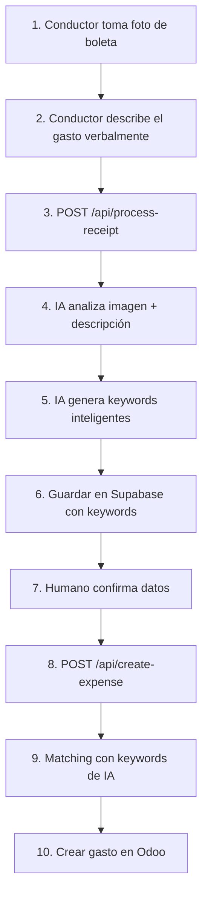

# Workflow Mejorado con Keywords de IA

## 🎯 Resumen

El workflow ahora incluye keywords generadas por IA para hacer el matching de categorías más preciso e inteligente.

## 📊 Flujo Completo



## 🔑 Mejoras Clave

### 1. Input del Conductor

**Antes:**
```json
{
  "trip_id": "uuid",
  "fotoUrl": "https://..."
}
```

**Ahora:**
```json
{
  "trip_id": "uuid",
  "fotoUrl": "https://...",
  "conductor_description": "Peaje de Cristo Redentor camino a Argentina"
}
```

### 2. Respuesta de la IA

**Antes:**
```json
{
  "referencia": "FAC-123",
  "razon_social": "AUTOPISTA",
  "total": 15000,
  "moneda": "CLP",
  "descripcion": "Peaje"
}
```

**Ahora:**
```json
{
  "referencia": "FAC-123",
  "razon_social": "AUTOPISTA LIBERTADORES",
  "total": 15000,
  "moneda": "CLP",
  "descripcion": "Peaje autopista internacional",
  "keywords": ["peaje", "tag", "autopista", "internacional", "cristo redentor"]
}
```

### 3. Matching Inteligente

El sistema ahora hace matching en este orden de prioridad:

1. **Keywords de IA** (confianza: 95%)
   - Si "peaje" está en las keywords de IA y hay una categoría con keyword "peaje" → Match!

2. **Match exacto con descripción** (confianza: 100%)
   - Si la descripción exacta está en las keywords de alguna categoría

3. **Match parcial mejorado** (confianza: variable)
   - Combina keywords de IA + descripción + términos relacionados
   - Da boost de confianza (+20%) si el match incluye keywords de IA

## 📝 Ejemplos Prácticos

### Ejemplo 1: Peaje Internacional

**Input del conductor:**
```
"Peaje de Cristo Redentor, ruta a Argentina"
```

**Keywords generadas por IA:**
```json
["peaje", "tag", "autopista", "internacional", "cristo redentor", "argentina"]
```

**Matching:**
```
Base de datos:
  - PEAJES NACIONALES → keywords: ["peaje", "tag", "autopista", "nacional"]
  - PEAJES INTERNACIONALES → keywords: ["peaje", "tag", "internacional", "frontera"]

Resultado: Match con "PEAJES INTERNACIONALES" (95% confianza)
Razón: Keyword "internacional" coincide
```

### Ejemplo 2: Combustible Específico

**Input del conductor:**
```
"Cargué nafta súper en YPF"
```

**Keywords generadas por IA:**
```json
["combustible", "nafta", "super", "ypf", "gasolina"]
```

**Matching:**
```
Base de datos:
  - COMBUSTIBLE DIESEL → keywords: ["combustible", "diesel", "gasoil"]
  - COMBUSTIBLE NAFTA → keywords: ["combustible", "nafta", "gasolina", "super"]

Resultado: Match con "COMBUSTIBLE NAFTA" (95% confianza)
Razón: Keywords "nafta", "super", "gasolina" coinciden
```

### Ejemplo 3: Alojamiento con Contexto

**Input del conductor:**
```
"Hotel en Mendoza"
```

**Keywords generadas por IA:**
```json
["hotel", "alojamiento", "hospedaje", "mendoza", "lodging"]
```

**Matching:**
```
Base de datos:
  - HOTEL NACIONAL → keywords: ["hotel", "alojamiento", "hospedaje", "nacional"]
  - HOTEL INTERNACIONAL → keywords: ["hotel", "lodging", "internacional", "extranjero"]

Resultado: Match con "HOTEL NACIONAL" (90% confianza)
Razón: Keywords "hotel", "alojamiento", "hospedaje" coinciden + contexto "Mendoza" (Argentina)
```

## 🔧 Implementación Técnica

### 1. Actualización del Agente IA (Python)

Ver archivo: `AI_AGENT_UPDATES.md` para código completo.

**Cambios principales:**
- Nuevo campo `conductor_description` en el request
- Nuevo campo `keywords` en el response
- System prompt mejorado para generar keywords contextuales
- Lógica para combinar imagen + descripción verbal

### 2. Endpoint `/api/process-receipt`

**Cambios:**
- Acepta `conductor_description` opcional
- Lo pasa al agente IA
- Guarda keywords en `metadata.ai_keywords`
- Guarda descripción del conductor en `metadata.conductor_description`

### 3. Category Matcher

**Nueva función:**
```typescript
findBestCategory(description: string, aiKeywords?: string[])
```

**Lógica de matching:**
1. Si hay keywords de IA, intentar match exacto primero
2. Match exacto con descripción
3. Match parcial combinando keywords IA + descripción
4. Boost de confianza si el match incluye keywords de IA

### 4. Endpoint `/api/create-expense`

**Cambios:**
- Extrae keywords de `boleta.metadata.ai_keywords`
- Las pasa a `findBestCategory()`
- Logging mejorado para debugging

## 🧪 Testing

### Test 1: Con Descripción del Conductor

```bash
curl -X POST http://localhost:3000/api/process-receipt \
  -H "Content-Type: application/json" \
  -d '{
    "trip_id": "uuid-del-trip",
    "fotoUrl": "https://imagen.jpg",
    "conductor_description": "Peaje de Cristo Redentor"
  }'
```

**Respuesta esperada:**
```json
{
  "success": true,
  "data": {
    "boleta_id": "...",
    "extracted_data": {
      "descripcion": "Peaje autopista",
      "keywords": ["peaje", "tag", "autopista", "internacional", "cristo redentor"]
    },
    "metadata": {
      "ai_keywords": ["peaje", "tag", "autopista", "internacional", "cristo redentor"],
      "conductor_description": "Peaje de Cristo Redentor"
    }
  }
}
```

### Test 2: Sin Descripción del Conductor

```bash
curl -X POST http://localhost:3000/api/process-receipt \
  -H "Content-Type: application/json" \
  -d '{
    "trip_id": "uuid-del-trip",
    "fotoUrl": "https://imagen.jpg"
  }'
```

**Respuesta esperada:**
```json
{
  "success": true,
  "data": {
    "boleta_id": "...",
    "extracted_data": {
      "descripcion": "Peaje",
      "keywords": ["peaje", "tag", "autopista"]
    },
    "metadata": {
      "ai_keywords": ["peaje", "tag", "autopista"]
    }
  }
}
```

### Test 3: Crear Gasto con Keywords

```bash
curl -X POST http://localhost:3000/api/create-expense \
  -H "Content-Type: application/json" \
  -d '{
    "boleta_id": "uuid-de-boleta-con-keywords"
  }'
```

**Logs esperados:**
```
Usando keywords de IA para matching: peaje, tag, autopista, internacional, cristo redentor
Usando keywords del agente IA: peaje, tag, autopista, internacional, cristo redentor
Match encontrado con keyword IA "peaje": PEAJES INTERNACIONALES
Categoría seleccionada automáticamente: PEAJES INTERNACIONALES (ID: 46707) con confianza 0.95
```

## 📋 Checklist de Configuración

### 1. Actualizar el Agente IA (Python)

- [ ] Agregar campo `keywords` al schema `ReceiptSchema`
- [ ] Agregar campo `conductor_description` al `GraphState`
- [ ] Actualizar `ReceiptRequest` en FastAPI
- [ ] Actualizar el system prompt para generar keywords
- [ ] Modificar `analyze_node` para procesar descripción del conductor
- [ ] Actualizar endpoint `/analyze-receipt`
- [ ] Probar con y sin `conductor_description`

### 2. Backend (Next.js)

- [x] Actualizar `/api/process-receipt` para recibir `conductor_description`
- [x] Guardar keywords en metadata de boleta
- [x] Actualizar `category-matcher.ts` para usar keywords de IA
- [x] Actualizar `/api/create-expense` para extraer keywords del metadata
- [x] Testing end-to-end

### 3. Configurar Categorías en Supabase

- [ ] Ejecutar queries para agregar keywords a categorías existentes
- [ ] Verificar que las keywords sean relevantes
- [ ] Probar matching con diferentes descripciones

### 4. Frontend (Opcional)

- [ ] Agregar input para descripción verbal del conductor
- [ ] Mostrar keywords generadas en la UI de confirmación
- [ ] Permitir editar keywords antes de confirmar
- [ ] Mostrar categoría sugerida con nivel de confianza

## 🎨 Ejemplo de UI Sugerida

```
┌─────────────────────────────────────────┐
│ Confirmar Gasto                         │
├─────────────────────────────────────────┤
│                                         │
│ [Imagen de la boleta]                  │
│                                         │
│ Descripción del conductor:             │
│ ┌─────────────────────────────────────┐│
│ │ Peaje de Cristo Redentor           ││
│ └─────────────────────────────────────┘│
│                                         │
│ Datos extraídos:                       │
│ • Monto: $15,000 CLP                   │
│ • Fecha: 17/11/2025                    │
│ • Descripción: Peaje autopista         │
│                                         │
│ Keywords generadas por IA:             │
│ [peaje] [tag] [autopista] [internacional]│
│                                         │
│ Categoría sugerida:                    │
│ 🎯 PEAJES INTERNACIONALES (95%)       │
│                                         │
│ [Confirmar]  [Editar]  [Cancelar]     │
└─────────────────────────────────────────┘
```

## 💡 Mejores Prácticas

### Para Conductores

1. **Ser específico**: "Peaje Cristo Redentor" > "Peaje"
2. **Incluir contexto**: "Almuerzo en ruta" > "Comida"
3. **Usar nombres conocidos**: "YPF" ayuda a identificar combustible
4. **Mencionar tipo**: "Hotel en..." vs solo el nombre del hotel

### Para Administradores

1. **Keywords variadas**: Incluir español + inglés cuando sea relevante
2. **Sinónimos**: "combustible", "nafta", "gasolina" para la misma categoría
3. **Actualizar regularmente**: Agregar keywords basándose en patrones reales
4. **Revisar logs**: Ver qué keywords genera la IA y ajustar la base de datos

### Para Desarrolladores

1. **Logging**: Siempre loggear keywords usadas y resultado del matching
2. **Confidence threshold**: Considerar rechazar matches con confianza < 50%
3. **Fallback manual**: Si no hay match, permitir selección manual de categoría
4. **Analytics**: Trackear tasa de éxito del matching automático

## 📊 Métricas de Éxito

### KPIs a Monitorear

1. **Tasa de matching automático exitoso**
   - Meta: > 85%
   - Cálculo: Gastos creados sin error / Total de gastos procesados

2. **Nivel de confianza promedio**
   - Meta: > 0.80
   - Cálculo: Promedio de confidence de matches exitosos

3. **Uso de descripción del conductor**
   - Meta: > 60%
   - Cálculo: Boletas con conductor_description / Total boletas

4. **Keywords efectivas**
   - Meta: Al menos 3 keywords por boleta
   - Cálculo: Promedio de keywords generadas

### Query SQL para Métricas

```sql
-- Tasa de matching exitoso
SELECT
  COUNT(*) FILTER (WHERE status = 'created') AS exitosos,
  COUNT(*) AS total,
  ROUND(
    100.0 * COUNT(*) FILTER (WHERE status = 'created') / COUNT(*),
    2
  ) AS tasa_exito_pct
FROM expense_processing_log
WHERE created_at >= NOW() - INTERVAL '30 days';

-- Boletas con descripción del conductor
SELECT
  COUNT(*) FILTER (WHERE metadata->>'conductor_description' IS NOT NULL) AS con_descripcion,
  COUNT(*) AS total,
  ROUND(
    100.0 * COUNT(*) FILTER (WHERE metadata->>'conductor_description' IS NOT NULL) / COUNT(*),
    2
  ) AS uso_pct
FROM boletas
WHERE created_at >= NOW() - INTERVAL '30 days';

-- Promedio de keywords por boleta
SELECT
  AVG(jsonb_array_length(metadata->'ai_keywords')) AS avg_keywords
FROM boletas
WHERE metadata->'ai_keywords' IS NOT NULL
  AND created_at >= NOW() - INTERVAL '30 days';
```

## 🚀 Roadmap Futuro

### Fase 1: Básico (Actual)
- [x] Keywords generadas por IA
- [x] Matching con keywords
- [x] Descripción verbal del conductor

### Fase 2: Aprendizaje
- [ ] Machine Learning para mejorar keywords
- [ ] Retroalimentación de usuarios
- [ ] Auto-actualización de keywords en base a uso real

### Fase 3: Inteligencia Avanzada
- [ ] Detección de anomalías en gastos
- [ ] Sugerencias de categorización basadas en patrones históricos
- [ ] Auto-aprobación de gastos recurrentes confiables

---

**Última actualización**: 18 de Noviembre 2025
